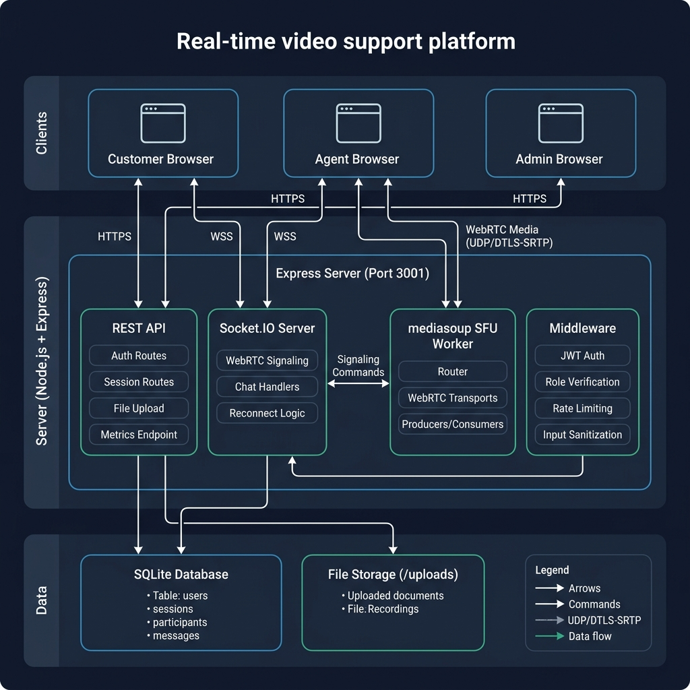

# Atomberg Video Support Platform

A real-time video support platform built for **Atomberg Technologies** that enables support agents to conduct live video calls with customers for product troubleshooting, installation guidance, and after-sales support. The platform uses a **Selective Forwarding Unit (SFU)** architecture powered by **mediasoup** for scalable, low-latency WebRTC media routing.

---

## Table of Contents

- [Project Overview](#project-overview)
- [Key Features](#key-features)
- [Technology Stack](#technology-stack)
- [Architecture Overview](#architecture-overview)
- [Project Structure](#project-structure)
- [Prerequisites](#prerequisites)
- [Setup Instructions](#setup-instructions)
- [Running the Application](#running-the-application)
- [Deployment (Production)](#deployment-production)
- [Exposing via ngrok (Remote Access)](#exposing-via-ngrok-remote-access)
- [API Reference](#api-reference)
- [Socket Events Reference](#socket-events-reference)
- [Database Schema](#database-schema)
- [Known Limitations](#known-limitations)
- [Troubleshooting](#troubleshooting)

---

## Project Overview

The Atomberg Video Support Platform allows support agents to create video call sessions, generate invite links, and conduct live video calls with customers. Customers join via a shareable link without needing to create an account. The platform supports real-time text chat, file sharing, screen sharing, and session recording -- all within a browser-based interface.

Three distinct user roles are supported:

| Role       | Description                                                                 |
|------------|-----------------------------------------------------------------------------|
| **Agent**  | Creates support sessions, conducts video calls, shares files, ends sessions |
| **Customer** | Joins sessions via invite link, participates in video calls and chat     |
| **Admin**  | Monitors all sessions, views system metrics, accesses full session history  |

---

## Key Features

- **SFU-Based Video Calls** -- mediasoup-powered Selective Forwarding Unit for efficient multi-party video
- **Real-Time Chat** -- In-call text messaging with message persistence and history
- **File Sharing** -- Upload and share documents, images, and PDFs during sessions (10 MB limit)
- **Screen Sharing** -- Both agents and customers can share their screen during calls
- **Invite Link System** -- Agents generate unique invite tokens; customers join via link without registration
- **Session Management** -- Full lifecycle management (waiting, active, ended) with duration tracking
- **Agent Dashboard** -- Active calls, session history, one-click session creation, and invite link generation
- **Admin Dashboard** -- Live sessions monitor, full session history with event logs, and system metrics panel
- **Reconnect Handling** -- 60-second grace period for agent disconnects; session state is preserved
- **Duplicate Join Prevention** -- Evicts old sockets when a user joins from a second tab or device
- **Role-Based Access Control** -- JWT authentication with route guards and middleware-enforced permissions
- **Rate Limiting** -- Auth endpoints (20 req/15 min) and API endpoints (60 req/min)
- **Input Sanitization** -- XSS prevention on chat messages and file URLs
- **Observability** -- `/api/metrics` endpoint exposing session counts, uptime, and memory usage
- **Automatic Cleanup** -- Temporary customer accounts older than 24 hours are purged every 6 hours
- **Client-Side Recording** -- Browser-based screen capture for session recording
- **Production Mode** -- Serves the built React SPA from the Express server with SPA fallback routing

---

## Technology Stack

### Backend

| Technology        | Purpose                                    |
|-------------------|--------------------------------------------|
| Node.js           | Server runtime                             |
| Express 5         | HTTP server and REST API framework         |
| Socket.IO         | Real-time bidirectional communication      |
| mediasoup 3       | SFU (Selective Forwarding Unit) for WebRTC |
| better-sqlite3    | Embedded SQLite database                   |
| JSON Web Tokens   | Authentication and authorization           |
| bcrypt            | Password hashing                           |
| multer            | File upload handling                       |
| express-rate-limit | API rate limiting                         |

### Frontend

| Technology        | Purpose                                    |
|-------------------|--------------------------------------------|
| React 19          | UI framework                               |
| Vite 8            | Build tool and dev server                  |
| React Router 7    | Client-side routing                        |
| mediasoup-client  | WebRTC client-side SFU integration         |
| Socket.IO Client  | Real-time communication with server        |
| Axios             | HTTP client for API calls                  |
| Tailwind CSS 4    | Utility-first CSS framework                |

---

## Architecture Overview

The platform follows a **client-server architecture** with an SFU media layer:

```
Customer Browser                    Agent Browser                   Admin Browser
      |                                  |                               |
      |   HTTPS / WSS                    |   HTTPS / WSS                 |  HTTPS
      +----------------------------------+-------------------------------+
                                         |
                              +----------+----------+
                              |    Express Server    |
                              |    (Port 3001)       |
                              +----------+----------+
                              |          |          |
                    +---------+   +------+------+   +-----------+
                    | REST API|   | Socket.IO   |   | Static    |
                    | Routes  |   | Signaling   |   | File      |
                    |         |   | + Chat      |   | Server    |
                    +----+----+   +------+------+   +-----+-----+
                         |               |                |
                    +----+----+   +------+------+   +-----+-----+
                    | Auth    |   | mediasoup   |   | /uploads  |
                    | Middle- |   | SFU Manager |   | directory |
                    | ware    |   | (Worker)    |   |           |
                    +----+----+   +------+------+   +-----------+
                         |               |
                    +----+---------------+----+
                    |     SQLite Database     |
                    |  (users, sessions,     |
                    |   participants, msgs)   |
                    +------------------------+
```

**Media Flow (SFU Pattern):**
1. Each participant creates a **send transport** and a **receive transport** via mediasoup
2. Audio/video tracks are **produced** on the send transport
3. Other participants **consume** those producers on their receive transports
4. The SFU router forwards media selectively -- no mixing or transcoding



---

## Project Structure

```
video-support-platform/
|-- client/                          # React frontend (Vite)
|   |-- public/                      # Static assets
|   |-- src/
|   |   |-- api/
|   |   |   +-- api.js               # Axios HTTP client wrapper
|   |   |-- components/
|   |   |   |-- ChatPanel.jsx        # In-call chat sidebar
|   |   |   |-- Controls.jsx         # Call controls (mute, camera, screen share, record)
|   |   |   +-- VideoGrid.jsx        # Video tile layout with PiP swap
|   |   |-- context/
|   |   |   +-- AuthContext.jsx       # JWT auth state provider
|   |   |-- hooks/
|   |   |   |-- useChat.js           # Chat socket hook
|   |   |   +-- useMediasoup.js      # mediasoup WebRTC hook
|   |   |-- pages/
|   |   |   |-- AdminDashboard.jsx   # Admin: live sessions, history, metrics
|   |   |   |-- AgentDashboard.jsx   # Agent: session list, create, manage
|   |   |   |-- CallRoom.jsx         # Video call room page
|   |   |   |-- JoinPage.jsx         # Customer invite link landing page
|   |   |   +-- Login.jsx            # Login and customer join page
|   |   |-- App.jsx                  # Root component with routing
|   |   |-- main.jsx                 # React entry point
|   |   +-- index.css                # Global styles and design system
|   |-- index.html                   # HTML entry point
|   |-- vite.config.js               # Vite configuration with proxy settings
|   +-- package.json
|
|-- server/                          # Node.js backend
|   |-- db/
|   |   |-- database.js              # SQLite connection, schema creation, default users
|   |   |-- models.js                # Data access layer (CRUD operations)
|   |   +-- seed.js                  # Demo data seeder script
|   |-- mediasoup/
|   |   |-- recorder.js              # Server-side recording utilities
|   |   +-- sfuManager.js            # SFU worker, rooms, transports, producers, consumers
|   |-- middleware/
|   |   +-- authMiddleware.js        # JWT verification and role-checking middleware
|   |-- routes/
|   |   |-- auth.js                  # Login and registration endpoints
|   |   +-- sessions.js              # Session CRUD, file upload, admin endpoints
|   |-- socket/
|   |   |-- chat.js                  # Chat message handlers with sanitization
|   |   +-- signaling.js             # WebRTC signaling, room join/leave, reconnect logic
|   |-- uploads/                     # Uploaded files storage (gitignored)
|   |-- .env                         # Environment variables (gitignored)
|   |-- index.js                     # Server entry point
|   +-- package.json
|
|-- .gitignore
+-- README.md
```

---

## Prerequisites

Before setting up the project, ensure the following are installed:

| Requirement    | Version    | Notes                                                     |
|----------------|------------|-----------------------------------------------------------|
| **Node.js**    | >= 18.x    | Required for mediasoup native addon compilation           |
| **npm**        | >= 9.x     | Comes bundled with Node.js                                |
| **Python**     | 3.x        | Required by mediasoup's C++ worker build (node-gyp)       |
| **C++ Build Tools** | --    | Windows: install "Desktop development with C++" via Visual Studio Build Tools. macOS: `xcode-select --install`. Linux: `build-essential` |

> **Important:** mediasoup requires native C++ compilation. On Windows, you must have the Visual Studio Build Tools installed with the "Desktop development with C++" workload. If you encounter build errors during `npm install` in the server directory, this is almost always the cause.

---

## Setup Instructions

### 1. Clone the Repository

```bash
git clone <repository-url>
cd video-support-platform
```

### 2. Install Server Dependencies

```bash
cd server
npm install
```

This will compile the mediasoup C++ worker. Expect this step to take 1-3 minutes depending on your machine.

### 3. Configure Environment Variables

Create (or edit) the file `server/.env`:

```env
PORT=3001
JWT_SECRET=<generate-a-random-256-bit-hex-string>
NODE_ENV=development
ANNOUNCED_IP=<your-local-ip-address>
RTC_MIN_PORT=10000
RTC_MAX_PORT=10100
```

| Variable        | Description                                                                                      |
|-----------------|--------------------------------------------------------------------------------------------------|
| `PORT`          | Server port (default: `3001`)                                                                    |
| `JWT_SECRET`    | Secret key for signing JWTs. Generate with `node -e "console.log(require('crypto').randomBytes(64).toString('hex'))"` |
| `NODE_ENV`      | Set to `production` to serve the built React app from Express                                   |
| `ANNOUNCED_IP`  | Your machine's LAN IP address (e.g., `192.168.1.100`). Required for WebRTC media connectivity on the local network. Find it with `ipconfig` (Windows) or `ifconfig` (macOS/Linux) |
| `RTC_MIN_PORT`  | Lower bound of UDP port range for WebRTC media (default: `10000`)                               |
| `RTC_MAX_PORT`  | Upper bound of UDP port range for WebRTC media (default: `10100`)                               |

### 4. Seed the Database (Optional)

Populate the database with demo sessions, messages, and customer accounts:

```bash
cd server
node db/seed.js
```

This creates pre-built demo data including completed sessions with chat history, which is useful for demonstrating the admin dashboard and session history features.

### 5. Install Client Dependencies

```bash
cd client
npm install
```

---

## Running the Application

### Development Mode (two terminals)

**Terminal 1 -- Start the backend server:**

```bash
cd server
npm start
```

The server will start on `http://localhost:3001`.

**Terminal 2 -- Start the frontend dev server:**

```bash
cd client
npm run dev
```

The Vite dev server will start on `https://localhost:5173` (HTTPS via the basic-ssl plugin). The dev server proxies `/api`, `/uploads`, and `/socket.io` requests to the backend on port 3001.

### Access the Application

Open `https://localhost:5173` in your browser and log in with the seeded credentials (see the credentials document).

---

## Deployment (Production)

### 1. Build the Client

```bash
cd client
npm run build
```

This generates optimized static files in `client/dist/`.

### 2. Set Environment to Production

In `server/.env`, set:

```env
NODE_ENV=production
```

### 3. Start the Server

```bash
cd server
npm start
```

The Express server will serve both the API and the built React SPA from `client/dist/`, with SPA fallback routing for client-side routes.

Access the application at `http://localhost:3001`.

---

## Exposing via ngrok (Remote Access)

To allow external customers to join calls from outside your local network:

```bash
ngrok http 3001
```

Update the `ANNOUNCED_IP` in `server/.env` to your machine's **local network IP** (not the ngrok URL). The ngrok tunnel handles HTTP/WebSocket forwarding, but WebRTC media traffic flows directly via the `ANNOUNCED_IP`.

> **Note:** ngrok free tier does not support UDP port forwarding. For remote WebRTC media connectivity beyond the LAN, you will need a TURN server (see Known Limitations).

---

## API Reference

All API endpoints are prefixed with `/api`. Protected routes require a `Bearer` token in the `Authorization` header.

### Authentication

| Method | Endpoint          | Auth   | Description                           |
|--------|-------------------|--------|---------------------------------------|
| POST   | `/api/auth/login` | No     | Login with username and password      |
| POST   | `/api/auth/register` | No  | Register a new customer account       |

### Sessions

| Method | Endpoint                              | Auth          | Description                                |
|--------|---------------------------------------|---------------|--------------------------------------------|
| GET    | `/api/sessions`                       | Agent / Admin | List sessions (agent's own or all for admin)|
| POST   | `/api/sessions`                       | Agent / Admin | Create a new session                       |
| GET    | `/api/sessions/:id`                   | Authenticated | Get session details with messages           |
| PUT    | `/api/sessions/:id/end`               | Agent / Admin | End a session                              |
| POST   | `/api/sessions/:id/upload`            | Authenticated | Upload a file to a session (max 10 MB)     |
| GET    | `/api/sessions/join/:token`           | No            | Resolve an invite token to session info    |

### Admin

| Method | Endpoint                                  | Auth  | Description                             |
|--------|-------------------------------------------|-------|-----------------------------------------|
| GET    | `/api/sessions/admin/all`                 | Admin | Get all active sessions with participants|
| GET    | `/api/sessions/admin/history`             | Admin | Get detailed session history             |
| GET    | `/api/sessions/admin/sessions/:id/events` | Admin | Get event log for a specific session     |
| GET    | `/api/sessions/admin/stats`               | Admin | Get extended system statistics           |

### Observability

| Method | Endpoint        | Auth  | Description                                      |
|--------|-----------------|-------|--------------------------------------------------|
| GET    | `/api/metrics`  | Admin | Server metrics (uptime, memory, session counts)  |

---

## Socket Events Reference

### Client to Server

| Event                    | Payload                                              | Description                        |
|--------------------------|------------------------------------------------------|------------------------------------|
| `joinRoom`               | `{ sessionId, token }`                               | Join a session room                |
| `getRouterRtpCapabilities` | `{ sessionId }`                                    | Get mediasoup router capabilities  |
| `createWebRtcTransport`  | `{ sessionId, direction }`                           | Create a send or receive transport |
| `connectWebRtcTransport` | `{ sessionId, transportId, dtlsParameters }`         | Connect a transport                |
| `produce`                | `{ sessionId, transportId, kind, rtpParameters, appData }` | Start producing media        |
| `consume`                | `{ sessionId, producerId, producerSocketId, rtpCapabilities }` | Start consuming a producer |
| `resumeConsumer`         | `{ sessionId, consumerId }`                          | Resume a paused consumer           |
| `producerClosed`         | `{ sessionId, producerId }`                          | Notify that a producer was closed  |
| `toggleVideoState`       | `{ sessionId, isVideoOff }`                          | Broadcast video on/off state       |
| `endSession`             | `{ sessionId }`                                      | End the session (agent only)       |
| `customerLeaving`        | `{ sessionId }`                                      | Customer explicitly leaving        |
| `sendMessage`            | `{ sessionId, content, type, fileUrl, fileName }`    | Send a chat message                |
| `getMessageHistory`      | `{ sessionId }`                                      | Request message history            |

### Server to Client

| Event                  | Payload                                            | Description                          |
|------------------------|----------------------------------------------------|--------------------------------------|
| `newPeer`              | `{ socketId, displayName, role }`                  | A new peer joined the room           |
| `newProducer`          | `{ producerId, producerSocketId, kind, appData }`  | A peer started producing media       |
| `producerClosed`       | `{ producerId, producerSocketId }`                 | A producer was closed                |
| `peerLeft`             | `{ socketId, displayName }`                        | A peer left the room                 |
| `peerVideoStateChanged`| `{ socketId, isVideoOff }`                        | A peer toggled their video           |
| `agentDisconnected`    | `{ timeoutSeconds }`                               | Agent disconnected (grace period)    |
| `agentReconnected`     | --                                                 | Agent reconnected within grace period|
| `sessionEnded`         | --                                                 | The session has ended                |
| `duplicateSession`     | `{ message }`                                      | Evicted due to duplicate join        |
| `newMessage`           | `{ id, sessionId, displayName, content, ... }`     | A new chat message                   |
| `messageHistory`       | `{ messages }`                                     | Full message history for a session   |

---

## Database Schema

The application uses an embedded **SQLite** database (`server/db/sqlite.db`) with four tables:

### users

| Column        | Type    | Description                           |
|---------------|---------|---------------------------------------|
| id            | TEXT PK | UUID                                  |
| username      | TEXT    | Unique username or email              |
| password_hash | TEXT    | bcrypt hash                           |
| role          | TEXT    | `agent`, `admin`, or `customer`       |
| created_at    | INTEGER | Unix timestamp                        |

### sessions

| Column       | Type    | Description                                 |
|--------------|---------|---------------------------------------------|
| id           | TEXT PK | UUID                                        |
| title        | TEXT    | Session title / description                 |
| invite_token | TEXT    | Unique token for the invite link            |
| created_by   | TEXT FK | Agent user ID who created the session       |
| status       | TEXT    | `waiting`, `active`, or `ended`             |
| started_at   | INTEGER | Unix timestamp when call started            |
| ended_at     | INTEGER | Unix timestamp when call ended              |
| created_at   | INTEGER | Unix timestamp when session was created     |

### participants

| Column       | Type    | Description                                 |
|--------------|---------|---------------------------------------------|
| id           | TEXT PK | UUID                                        |
| session_id   | TEXT FK | References sessions.id                      |
| user_id      | TEXT    | References users.id (nullable for guests)   |
| display_name | TEXT    | Display name shown in the call              |
| role         | TEXT    | `agent` or `customer`                       |
| joined_at    | INTEGER | Unix timestamp                              |
| left_at      | INTEGER | Unix timestamp (null if still connected)    |

### messages

| Column       | Type    | Description                                 |
|--------------|---------|---------------------------------------------|
| id           | TEXT PK | UUID                                        |
| session_id   | TEXT FK | References sessions.id                      |
| sender_id    | TEXT    | User ID of the sender                       |
| display_name | TEXT    | Sender's display name                       |
| content      | TEXT    | Message text content                        |
| message_type | TEXT    | `text` or `file`                            |
| file_url     | TEXT    | Relative path to uploaded file (nullable)   |
| file_name    | TEXT    | Original filename (nullable)               |
| created_at   | INTEGER | Unix timestamp                              |

---

## Known Limitations

1. **No TURN Server** -- WebRTC media relies on direct UDP via the `ANNOUNCED_IP`. A TURN relay server (e.g., coturn) is needed for clients behind restrictive NATs or for production deployments.

2. **SQLite** -- Used for zero-configuration simplicity. Not suited for horizontal scaling; migrate to PostgreSQL for production.

3. **Single mediasoup Worker** -- One worker process handles all sessions. For high concurrency, multiple workers should be spawned across CPU cores.

4. **Browser Support** -- Tested on Chrome and Edge. Safari and Firefox may have partial WebRTC/mediasoup-client support.

---

## Troubleshooting

| Issue                                    | Solution                                                                                      |
|------------------------------------------|-----------------------------------------------------------------------------------------------|
| **mediasoup install fails**              | Ensure C++ build tools and Python 3 are installed. On Windows: Visual Studio Build Tools with "Desktop development with C++" workload. |
| **Black video feed**                     | Check that `ANNOUNCED_IP` matches your machine's LAN IP. Verify the UDP port range (10000-10100) is not blocked by firewall. |
| **Cannot connect from another device**   | Both devices must be on the same LAN, or use ngrok + TURN server. Update `ANNOUNCED_IP` accordingly. |
| **"Too many attempts" error on login**   | Rate limiter triggered. Wait 15 minutes or restart the server.                                |
| **Database locked errors**               | SQLite does not handle concurrent writes well. Ensure only one server instance is running.    |
| **Vite proxy not working**               | Ensure the backend is running on port 3001 before starting the Vite dev server.               |

---

## License

This project is proprietary software developed for Atomberg Technologies.
